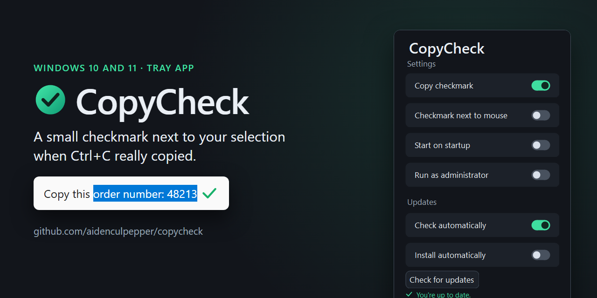

  

<h1 align="center">CopyCheck</h1>

  A Windows tray app that puts a small checkmark next to your selected text when Ctrl+C actually copied it. 
  <a href="https://github.com/aidenculpepper/copycheck/releases/latest"><strong>Download CopyCheckSetup.exe</strong></a> · Windows 10 and 11, 64-bit

## Why

Windows gives you no sign that Ctrl+C did anything. If the selection was empty, or the app didn't put anything on the clipboard, you only find out when you paste. CopyCheck watches for that one moment and draws a quick green checkmark at the end of the text you copied, so you know before you switch windows.

## What it does

- Shows a copy confirmation checkmark at the end of your selection after a successful Ctrl+C.
- Also finds the selection in browsers and in Electron and WebView apps, through the documents they expose to Windows UI Automation.
- Can show the checkmark next to the mouse pointer instead, for apps that don't report where the selection is.
- Starts with Windows and can run as administrator. A fresh install turns both on.
- Updates itself from this repository's GitHub releases, with automatic installing available as an opt-in.
- Lets you switch the checkmark off in Settings without quitting the app.

## How it decides a copy worked

Pressing Ctrl+C is not proof that anything was copied, so CopyCheck doesn't react to the key alone. Its keyboard hook only looks at the C key, and only when Ctrl is held and Alt isn't. It ignores keystrokes that other software injected, and it doesn't record or store anything you type.

After Ctrl+C, it waits for the clipboard to change. A copy only counts when all of these are true:

- the clipboard's sequence number changed,
- the process that owns the clipboard is the window you pressed Ctrl+C in,
- the clipboard holds text that isn't blank.

If you switch to another window first, the attempt is canceled. The first copy after startup can be slow, because accessibility providers sometimes report no selection bounds at first, so CopyCheck keeps retrying every 100 ms for up to two seconds once the clipboard is confirmed.

To place the checkmark, it asks UI Automation for the current selection in that window, then in up to 24 document elements, then in up to 80 other text controls. The selected text has to match what landed on the clipboard (ignoring differences in whitespace), and an empty text box caret never counts. The lookup runs in the background, and its result is thrown out if a newer copy started, the clipboard changed again or the window changed. When CopyCheck can't find the selection, it shows nothing. It never guesses a caret position.

The checkmark itself draws in over 170 ms and fades out by 700 ms. It's a click-through layered window that never takes focus, and it scales with the display's DPI.

The updater makes the only network requests: one to GitHub's latest-release API and, when there's a newer version, one to download the installer. It accepts only a published, stable release with a higher version number. The installer has to come from this repository's exact release URL, and its size and SHA-256 digest have to match what GitHub reports, or nothing is installed. No GitHub credentials are embedded.

## Proof

The repository has no automated test suite. Each release's notes list the checks run before it shipped; for 1.0.22 those were 49 passing checks plus successful app and installer builds. The notes are also plain about what hasn't been tested yet (see Limits).

CopyCheck.cs compiled cleanly with the .NET Framework 4 C# compiler on 2026-10-06, when the share images in assets/ were rendered from it.

## Install

1. Download CopyCheckSetup.exe from the [latest release](https://github.com/aidenculpepper/copycheck/releases/latest).
2. Run it while signed in to an administrator Windows account. If you type another account's credentials into the UAC prompt instead, Setup stops with an error, because it can't set up elevated startup for your session that way.
3. If SmartScreen warns you, that's because the build is unsigned.

Setup installs into Program Files\CopyCheck and can add a desktop shortcut. A fresh install turns on startup and administrator mode, and an upgrade keeps the preferences you already have.

Before installing anything, Setup asks GitHub whether a newer installer exists and installs that one instead. If the check fails, it asks you before installing the version it shipped with.

Once it's running, left-click the tray icon to open Settings. Right-click it for Settings and Exit.

### Upgrading from older versions

Version 1.0.6 can't update itself, so it needs one manual install of something newer. Versions 1.0.7 through 1.0.9 can install this release with their manual update button.

### Removing it

Use the Uninstall CopyCheck button in Settings, which opens the normal Windows uninstaller. The button only works in the installed copy.

## Settings

| Setting | Default | What it does |
| --- | --- | --- |
| Copy checkmark | On | Shows the checkmark after a confirmed copy. Off leaves the app running quietly. |
| Checkmark next to mouse | Off | Shows the checkmark beside the pointer instead of at the selection. Takes effect immediately. |
| Start on startup | On after a fresh install | Starts CopyCheck when you sign in, through an entry you can see under Startup apps in Task Manager. |
| Run as administrator | On after a fresh install | Starts CopyCheck elevated, through a per-user scheduled task that runs at highest privilege. |
| Check automatically | On | Checks GitHub Releases at launch and every six hours. |
| Install automatically | Off | Downloads, verifies and silently installs newer stable releases, then relaunches. Only available while automatic checks are on. |

Check for updates and Install update are always available. Install update uses the same silent Setup and relaunch even with automatic installing off. Turning automatic installing off during a download stops Setup from launching.

If a check or download fails, or you cancel the UAC prompt, CopyCheck keeps running. If Setup fails after it has launched, you may need to open CopyCheck again. When CopyCheck isn't running elevated, Windows may still ask for administrator approval. Silent updates skip the wizard screens and never reboot Windows.

Upgrades keep the startup toggle, and they also keep startup disabled if you disabled it in Task Manager.

Preferences are small text files in `%LOCALAPPDATA%\CopyCheck`. Saves replace a temporary file atomically and retry for up to three seconds if another process briefly has the file locked. A lock that doesn't clear, or a permissions error, shows up as an error.

## Limits

- Only text copies count. Copying a file or an image shows nothing.
- Only Ctrl+C counts, not a right-click Copy menu item.
- Some apps don't expose where the selection is. Those get no checkmark unless you turn on Checkmark next to mouse.
- Windows 10 and 11, 64-bit only.
- The installer is unsigned, so SmartScreen warnings are possible. Signing needs the publisher's certificate; [SIGNING.md](SIGNING.md) explains the optional certificate-store signing that Build.ps1 supports.
- Not yet tested: a full elevated silent install and relaunch, behavior right after a reboot, live mouse-mode copying, live selection in ChatGPT, and full live sign-in and uninstall on a normal Windows desktop.

## Building and publishing

Build.ps1 compiles CopyCheck.cs with the C# compiler that ships with .NET Framework 4 and packages it with Inno Setup 6.7 or later (pass `-InnoCompiler` if ISCC.exe isn't on your path or in its default folder). To sign, also pass `-SignTool` and `-CertificateThumbprint`.

To publish a release:

1. Bump the assembly versions, `Updates.Current` and the Inno versions so they all match.
2. Run Build.ps1.
3. Commit CopyCheckSetup.exe, the generated release.json and RELEASE_NOTES.md together to main.

The publish-release.yml workflow checks the installer against release.json and creates a new stable GitHub release, and the website's latest-release download link picks it up. Never reuse a version number that has already been published.

To rebuild the share images in assets/ from the current code, run `scripts\social\Build-SocialImages.ps1`.

## Recent changes

- 1.0.22: Reverted the size/duration controls and mouse badge from 1.0.21; restored the plain checkmark and kept mouse placement.
- 1.0.21: Added animation controls and a mouse badge; reverted in 1.0.22.

- 1.0.20: Added Checkmark next to mouse, off by default and saved per user.
- 1.0.19: The Updates heading matches the smaller, muted Settings label.
- 1.0.18: CopyCheck is now the main heading in Settings, above a smaller Settings label.
- 1.0.17: Preference saves tolerate files that are briefly locked during installation.
- 1.0.16: The checkmark is anchored to the copied selection in the source window, and empty text box carets are rejected.
- 1.0.15: Update status sits under Check for updates, green with a small checkmark when you're current and muted red when an update is available. Uninstall has a light red tint, and the installed version is at the bottom.
- 1.0.14: The first copy after startup retries clipboard readiness and text bounds instead of giving up.

## Files

| File | What it is |
| --- | --- |
| CopyCheck.cs | The whole app, one C# file |
| LICENSE | MIT license |
| CopyCheck.iss | Inno Setup script for the installer |
| Build.ps1 | Builds the app and installer and writes release.json |
| CopyCheckSetup.exe | The current installer |
| release.json | Version and SHA-256 of the current installer |
| RELEASE_NOTES.md | Notes for the current release |
| SIGNING.md | Notes on code signing and SmartScreen |
| scripts/social/ | Renders the share images from the real app |

## License

MIT. See [LICENSE](LICENSE).
